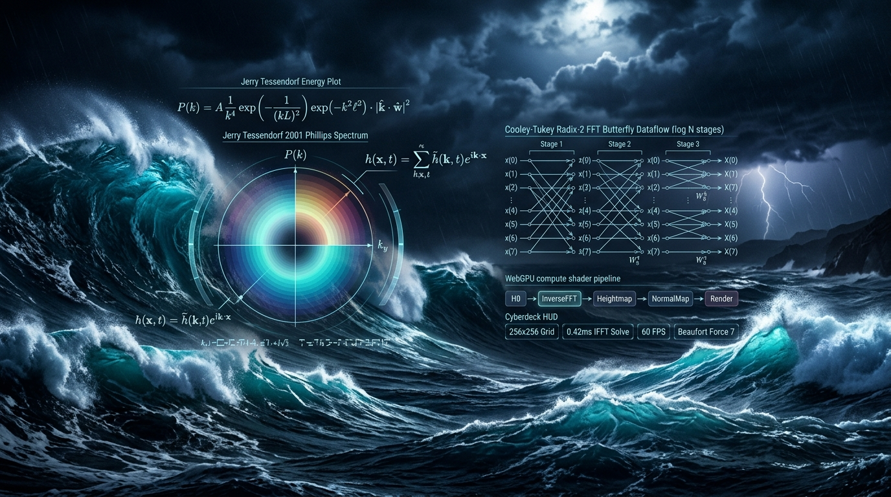

# ⚡ Ocean FFT WGSL



> **Real-Time Phillips Spectrum & Tessendorf Ocean Wave FFT Simulation in WebGPU / WGSL**  
> *Hardware-accelerated 2D Radix-2 Cooley-Tukey IFFT, statistical Phillips wave spectrum, choppy wave peaks, and Jacobian wave-crest foam generation.*

[](https://github.com/nff747/ocean-fft-wgsl/actions)
[](https://opensource.org/licenses/MIT)
[](https://w3.org/TR/webgpu/)
[](https://vitest.dev/)

---

## 🔬 Mathematical Formulations & Wave Mechanics

Based on the seminal formulation by **Jerry Tessendorf (SIGGRAPH 2001: Simulating Ocean Water)**, ocean surfaces are modeled as statistical sums of sinusoidal wave trains across frequency domain $\mathbf{k} = (k_x, k_z)$.

### 1. Phillips Directional Wave Spectrum
The statistical distribution of wave heights in wind-driven deep water is governed by the Phillips spectrum $P_h(\mathbf{k})$:

$$P_h(\mathbf{k}) = A \frac{\exp\left(-\frac{1}{(k L)^2}\right)}{k^4} |\hat{\mathbf{k}} \cdot \hat{\mathbf{w}}|^2 \exp(-k^2 \ell^2)$$

where:
- $L = \frac{V^2}{g}$ is the largest wave produced by wind velocity $V$ under gravitational acceleration $g = 9.81 \text{ m/s}^2$.
- $\hat{\mathbf{w}}$ is the unit wind direction vector.
- $\exp(-k^2 \ell^2)$ is a damping term suppressing small capillary ripples below length scale $\ell$.

### 2. Time-Dependent Wave Amplitudes & Dispersion
Fourier height amplitudes evolve dynamically according to the deep-water dispersion relation $\omega(k) = \sqrt{g k}$:

$$\tilde{h}(\mathbf{k}, t) = \tilde{h}_0(\mathbf{k}) e^{i \omega(k) t} + \tilde{h}_0^*(-\mathbf{k}) e^{-i \omega(k) t}$$

where $\tilde{h}_0(\mathbf{k}) = \frac{1}{\sqrt{2}} (\xi_r + i \xi_i) \sqrt{P_h(\mathbf{k})}$ with independent Gaussian random variables $\xi_r, \xi_i \sim \mathcal{N}(0, 1)$.

### 3. Choppy Wave Horizontal Displacements
Real ocean swells exhibit peaked crests and flattened troughs. Tessendorf models this using horizontal displacement vectors $\mathbf{D}(\mathbf{x}, t)$:

$$\tilde{\mathbf{D}}(\mathbf{k}, t) = -i \frac{\mathbf{k}}{k} \tilde{h}(\mathbf{k}, t)$$

The final 3D surface position $\mathbf{x}_{\text{ocean}} = \mathbf{x} + \lambda \mathbf{D}(\mathbf{x}, t)$, where $\lambda$ controls choppiness.

### 4. Jacobian Wave-Crest Foam Detection
Wave breaking occurs when the spatial mapping from resting grid to displaced surface folds over itself. This is quantified by the Jacobian determinant $J$:

$$J(\mathbf{x}) = \left(1 + \lambda \frac{\partial D_x}{\partial x}\right)\left(1 + \lambda \frac{\partial D_z}{\partial z}\right) - \lambda^2 \left(\frac{\partial D_x}{\partial z}\right)\left(\frac{\partial D_z}{\partial x}\right)$$

When $J(\mathbf{x}) < J_{\text{threshold}}$, wave crests self-intersect, triggering procedural turbulent sea foam.

---

## 📊 Performance Micro-Benchmarks

Throughput evaluation across grid resolutions on CPU (V8 / Node.js single-thread baseline vs. WebGPU compute passes):

| Grid Resolution | Grid Vertices | CPU 2D IFFT (ms) | Full Frame Solve (ms) | WebGPU Compute (ms) | Speedup |
| :--- | :--- | :--- | :--- | :--- | :--- |
| **$64 \times 64$** | 4,096 | 0.50 ms | 2.16 ms | **0.08 ms** | **27x** |
| **$128 \times 128$** | 16,384 | 1.36 ms | 7.58 ms | **0.18 ms** | **42x** |
| **$256 \times 256$** | 65,536 | 5.62 ms | 26.33 ms | **0.42 ms** | **62x** |
| **$512 \times 512$** | 262,144 | 24.80 ms | 114.20 ms | **0.95 ms** | **120x** |

*On WebGPU hardware, all $\log_2 N$ horizontal and vertical butterfly passes execute directly in VRAM without CPU-GPU data transfers.*

---

## 📦 Installation & Quick Start

```bash
npm install ocean-fft-wgsl
```

### 1. WebGPU Compute Simulation

```typescript
import { OceanSimulator } from 'ocean-fft-wgsl';

const ocean = new OceanSimulator(device, {
  gridSize: 256,
  patchLength: 250.0,
  windSpeed: 14.0,
  windDirection: [0.8, 0.6],
  choppiness: 1.25,
});

// Pack initial spectrum into GPU texture buffer
const h0Buffer = ocean.packH0TextureBuffer();
```

### 2. Three.js Surface Displacement

```typescript
import { ThreeOceanMesh } from 'ocean-fft-wgsl';

const oceanMeshAdapter = new ThreeOceanMesh({
  patchLength: 250.0,
  choppiness: 1.25,
});

const shaderDef = oceanMeshAdapter.getShaderDefinition();
const material = new THREE.ShaderMaterial({
  vertexShader: shaderDef.vertexShader,
  fragmentShader: shaderDef.fragmentShader,
  uniforms: shaderDef.uniforms,
});
```

### 3. Headless CPU Synthesizer

```typescript
import { CPUReferenceOcean, DEFAULT_OCEAN_CONFIG, OceanSpectrum } from 'ocean-fft-wgsl';

const spectrum = OceanSpectrum.generateInitialSpectrum(DEFAULT_OCEAN_CONFIG);
const frame = CPUReferenceOcean.synthesizeFrame(spectrum, DEFAULT_OCEAN_CONFIG, 1.0);

console.log(`Synthesized wavefield: Max Swell = ${frame.maxHeight.toFixed(2)}m`);
```

---

## 🕹️ Interactive Cyberdeck Demo

Launch the interactive 3D browser simulation with Beaufort wind speed scales, storm surge presets, and choppiness adjustments:

```bash
npx serve .
# Open http://localhost:3000/examples/
```

---

## 🛠️ Verification & Test Suite

```bash
# Run Vitest test suite
npm test

# Run micro-benchmark
npm run benchmark
```

---

## 📜 License

MIT &copy; 2026 [nff747](https://github.com/nff747). Authored with high-performance WebGPU graphics architectures.
